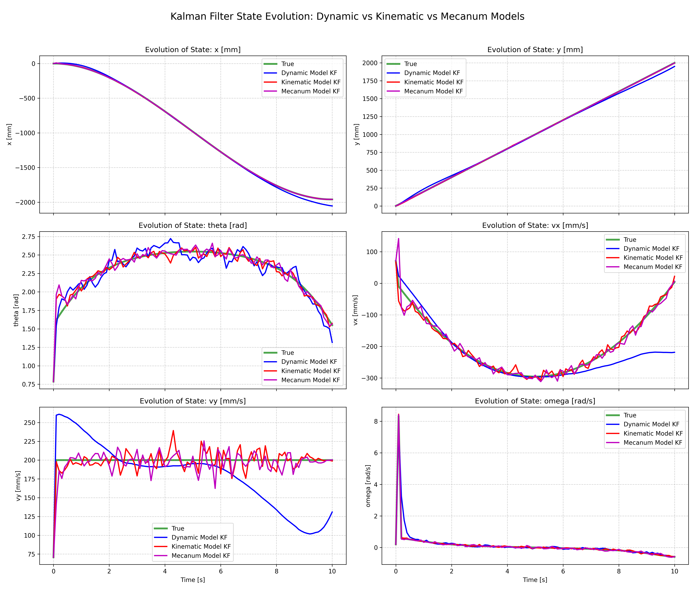
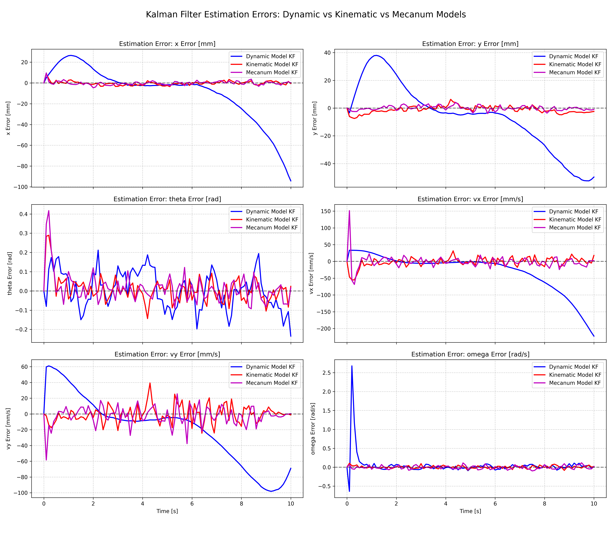
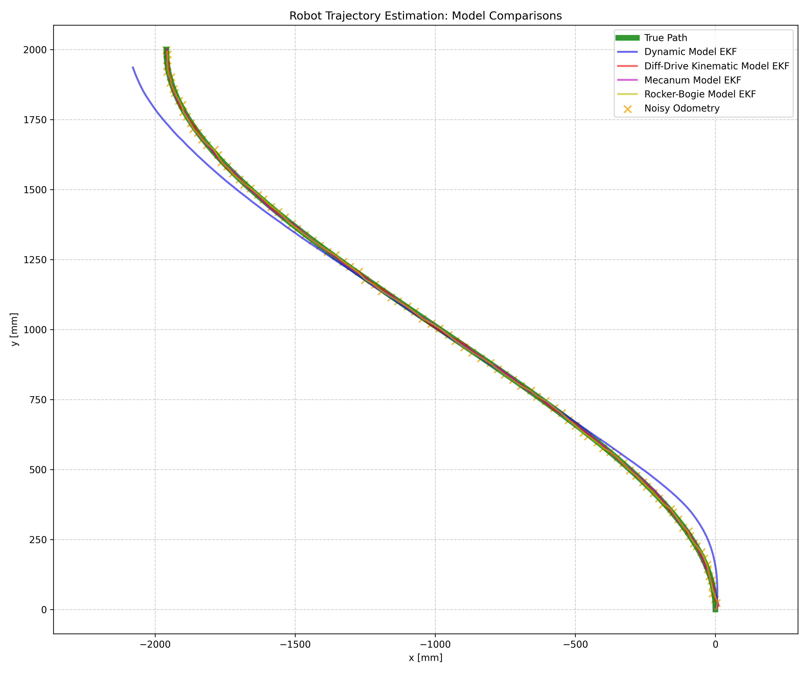

Perseverance is an open‑source mobile robot inspired by NASA’s Mars rover. The project focuses on robust state estimation for a 6‑wheel rocker‑bogie platform using an Extended Kalman Filter (EKF) within a modular ROS 2 package for sensor fusion and, later, SLAM and navigation. It derives the non‑linear kinematic model and Jacobians, implements multiple drive‑base models (differential drive, mecanum, and rocker-bogie), and benchmarks performance using IMU and wheel‑odometry data.

<em>Work in progress — more results and equations coming soon.</em>

  
  

  

