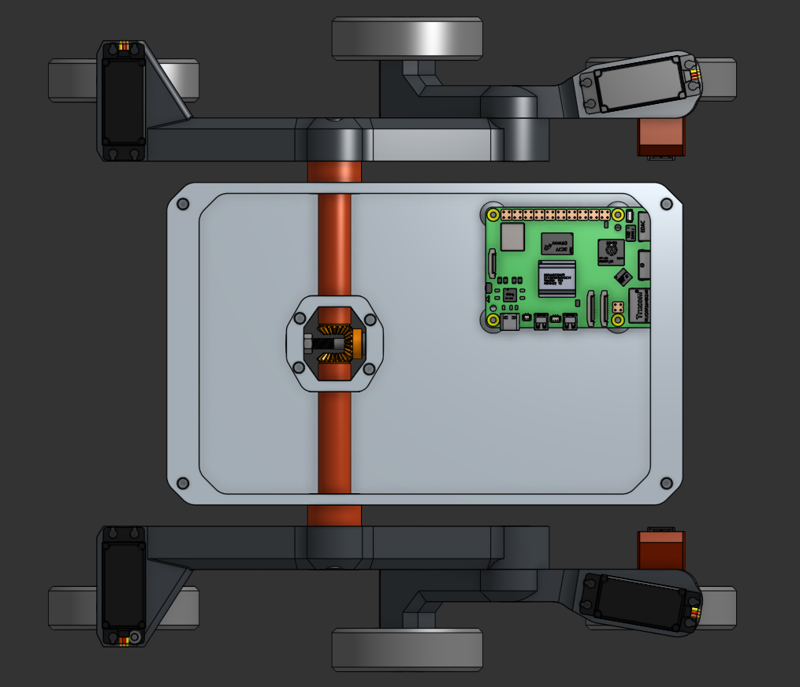
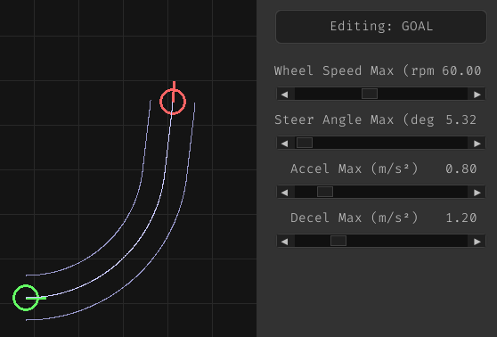

Perseverance is an open‑source mobile robot inspired by NASA’s Mars rover. The project focuses on robust state estimation for a 6‑wheel rocker‑bogie platform using an Extended Kalman Filter (EKF) within a modular ROS 2 package for sensor fusion and, later, SLAM and navigation. I derive the non‑linear kinematic model and Jacobians, implements multiple drive‑base models (differential drive, mecanum, and rocker-bogie), and benchmark performance using IMU and wheel‑odometry data.

The primary purpose of this project is to learn more about the full robotics stack for a mobile robot, including EKF SLAM, navigation, and control. I've selected the 6-wheel MARS Rover form factor because it's my favorite robot and I want to try and build a novel motion model and autonomous navigation stack for the rover and open-source it for others to try.

<em>Work in progress — more images, math, and code coming soon.</em>

  

Check out the interactive python files in the `prototyping` folder in the [GitHub repository](https://github.com/Sharwin24/Perseverance) for a deeper dive and visualization of the ackermann steering and rocker-bogie kinematics. Run `rover_teleop.py` to teleoperate the rover and visualize the steering geometry with the instantaneous center of rotation (ICR) and turning radius visualized. Run `interactive_planner.py` to explore different configurations of velocity/acceleration limits and steering angle limits while planning a smooth trajectory between a start and goal pose.

  
  

