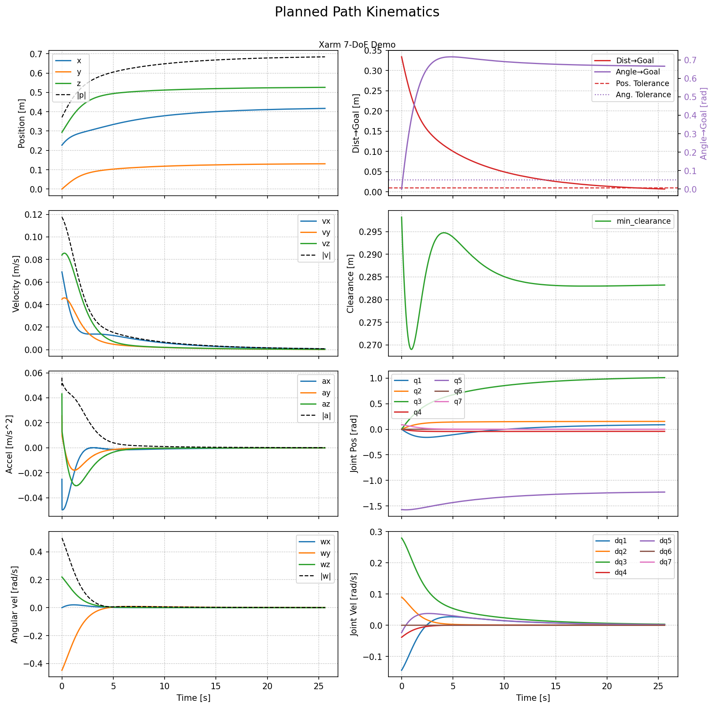

Potential fields offer a computationally efficient method for real-time motion planning and obstacle avoidance in robotic systems. By modeling the robot's environment as a field of attractive and repulsive forces, potential field methods enable robots to navigate complex environments while avoiding collisions. This approach is particularly useful for robotic manipulators operating in complex obstacle-rich environments, where traditional motion planning algorithms may struggle to provide real-time solutions.

This project offers a potential field based motion planning library for robotic manipulators, written in C++ and compatible with ROS2. Utilizing attractive and repulsive force generation in SE(3), whole-body obstacle avoidance using FCL collision geometry, users only need to submit their robot's URDF and inverse kinematics solvers to plan smooth, collision-free trajectories. The library offers two main methods for motion planning:

1. **SE(3) Task-Space Planner**: Integrates the planning frame as a 6D pose through the potential field, using the robot's inverse kinematics function to generate joint position and velocity trajectories.

  
  

  
Example motion of Xarm-7 using task-space planning and end-effector velocity control

  
Example path through obstacle-rich environment with translational and rotational attraction

2. **Whole-Body Velocity Planner**: Computes repulsive forces throughout the robot's links and combines them with attractive forces at the end-effector to produce a joint velocity trajectory that avoid obstacles while moving toward the goal.

  
   

_TODO: Another real robot demo video with WBV planning_

## Repository Structure

  

### Core C++ Library
The `PotentialField` class manages the overall potential field representation, and offers path planning methods among others to interact/query the field. The core library has the following features:
  *   **Obstacle Primitives:** Capable of representing primitives and mesh obstacles with signed distance queries via FCL.
  *   **Robot Kinematics:** The `PFKinematics` module handles URDF parsing, forward kinematics, and Jacobian calculations to understand the robot's geometry and state and provides the `PotentialField` class with `ObstacleType::ROBOT` obstacles to represent the robot's links in the environment, enabling whole-body obstacle avoidance.
  *   **IK & Robot Plugins:** Abstract Base Classes that provide an interface for inverse kinematics solvers and robot-specific controllers. Users can implement their own derived classes to implement their own robot's kinematics and control methods.
  *   **Math Functions:** Contains the mathematical implementations for attractive/repulsive forces, RK4 integration, and velocity/acceleration limiting via soft-saturation and rate-limiting.

### ROS2 Application Layer
The `pfield_manager` node is the central hub that bridges ROS to the underlying C++ logic. Internally, it maintains an instance of the `PotentialField` class and exposes its functionality through a handful of services and topics.

- **Services:**
  - **`PlanPath`:** Clients can request a end-effector trajectory (position and velocity), and/or a joint trajectory by providing start and goal poses, initial joint states, and planning parameters (tolerance, planning method, and max planning time)
  - **`ComputeAutonomyVector`:** Clients can utilize this service to get an instantaneous end-effector velocity command based on the current robot state (end-effector pose or joint angles) and goal pose. This is useful when fusing with real-time teleoperation or higher-level planners.
- **Topics:** There are 3 topics a user can publish to in order to update the internal state of the potential field instance:
  - `pfield/planning_goal_pose`: Accepts a `geometry_msgs/Pose` message to update the internal potential field instance's goal pose.
  - `pfield/query_pose`: Accepts a `geometry_msgs/Pose` message to update a live query pose to help visualize the potential field's forces in RViz.
  - `pfield/obstacles`: The node listens to this topic to update the set of environment obstacles using `potential_fields_interfaces/ObstacleArray` messages.

## Future Work
There are several avenues for future development and improvements the the library and ROS integration, including open-source contributions, feature requests, and bug reports. To highlight some of the most important and impactful ones:

- **Dynamic Obstacles:** Currently, dynamic obstacles are able to be tagged as such and ignored, but the library does not yet consider them when evaluating field forces.
- **Self-Collision Avoidance:** While the library can represent the robot's links and support whole-body obstacle avoidance by integrating repulsive forces onto each link into joint velocities, it does not yet support self-collision avoidance. In order to support this, the library would need to expand into a hybrid between configuration-space planning and whole-body velocity planning.
- **Improving Whole-Body Velocity Planning:** The current WBV planner uses a simple weighted sum of repulsive forces on each link combined with attractive forces at the end-effector. Future work could explore more advanced optimization-based approaches to better balance obstacle avoidance and goal attraction. Additionally, converting joint torques into joint velocities using robot dynamics could improve performance.
- **Profiling and Optimization:** Further profiling and optimization of the core C++ library could yield performance improvements, especially for high-DOF robots or complex environments with many obstacles. There are tons of opportunities for computational improvements regarding potential field evaluation, parallelization, and other lower impact micro-optimizations.

<strong>Potential Field Equations</strong>

These equations were obtained from the [Principles of Robot Motion: Theory, Algorithms, and Implementations](https://ieeexplore.ieee.org/book/6267238) textbook and [Real-Time Obstacle Avoidance for Manipulators and Mobile Robots](https://ieeexplore.ieee.org/stamp/stampCaCancaCccCfaksdfojas;kfjd;ksldadjf.jsp?tp=&arnumber=1087247), which describes the derivation of the potential equations, how to obtain the gradients, and how to obtain a velocity from the gradients.

In this library, the potential field produces a task-space wrench over the robot's end-effector pose:

- Linear force  \\(\mathbf{F}(q)\\) `[N]` from the translational potential
- Torque \\( \boldsymbol{\tau}(q) \\) `[Nm]` from the rotational potential

This wrench is mapped to a task-space twist \\(T(q)\\) using constant gains:

  \[
  \mathbf{v}(q) = k_{lin}\ \cdot \mathbf{F}(q) \\
  \boldsymbol{\omega}(q) = k_{ang} \cdot \boldsymbol{\tau}(q) \\
  T(q) = \begin{bmatrix}\mathbf{v}(q) \\ \boldsymbol{\omega}(q) \end{bmatrix}
  \]

with defaults of \\(k_{lin} = 1.0\,[(\mathrm{m/s})/\mathrm{N}]\\) and \\(k_{ang} = 1.0\,[(\mathrm{rad/s})/\mathrm{Nm}]\\).

The potential functions are scalar fields representing potential energy (Newton-meters `[Nm]`). The gradient of the potential is represented as a force (Newtons `[N]`). To obtain velocity vectors, we use some parameter \\(\left(\zeta \text{ and } \eta\right)\\) that acts as an inverse damping coefficient (Newton-seconds / meter `[Ns/m]`) to convert the force into a velocity (meters / second `[m/s]`).

#### Attractive Potential
Attractive Potential is computed using a combined Conical and Quadratic potential function. This approach ensures a constant attractive force at large distances (Conical) to prevent high velocities, while switching to a quadratic behavior near the goal to ensure smooth convergence without chattering. The transition occurs at a distance \\(\Gamma\\), which can be dynamic based on the environment (e.g., clearance from obstacles) or a fixed parameter.

  \[
  U_{att}(q) = \begin{cases}
  \frac{1}{2}\zeta D(q, q_{goal})^2 & D(q, q_{goal}) \le \Gamma \\
  \Gamma \zeta D(q, q_{goal}) - \frac{1}{2}\zeta \Gamma^2 & D(q, q_{goal}) > \Gamma
  \end{cases}
  \]

The gradient (force) is:

  \[
  \mathbf{F}_{att}(q) = -\nabla U_{att}(q) = \begin{cases}
  -\zeta (q - q_{goal}) & D(q, q_{goal}) \le \Gamma \\
  -\frac{\Gamma \zeta}{D(q, q_{goal})} (q - q_{goal}) & D(q, q_{goal}) > \Gamma
  \end{cases}
  \]

Where:
- \\(\zeta\\) is the *attractive gain* parameter
- \\(D(q, q_{goal})\\) is the Euclidean distance between \\(q\\) and \\(q_{goal}\\)
- \\(\Gamma\\) is the quadratic threshold distance `[m]` (Also known as \\(d^*\\) in some literature)

#### Rotational Attraction
Let \\(q_c\\) be the current unit quaternion and \\(q_g\\) the goal orientation. The geodesic distance \\(\theta \in [0,\pi]\\) is the shortest rotation aligning \\(q_c\\) to \\(q_g\\). Define the quaternion difference

\[
q_{diff} = q_c^{*} \otimes q_g,
\]

where \\(q_c^{*}\\) is the conjugate of \\(q_c\\) and the corresponding unit rotation axis \\(\mathbf{u} = \frac{\vec{q_{diff}}}{\lVert\vec{q_{diff}}\rVert}\\). The attractive rotational torque is proportional to the geodesic angle and acts about \\(\mathbf{u}\\):

\[
\boldsymbol{\tau}_{att}(q) = -\,\omega\,\theta\,\mathbf{u}
\]

applied only when \\(\theta\\) exceeds a small threshold. Here \\(\omega\\) is the rotational attractive gain.

#### Repulsive Potential
Repulsion increases with proximity to each obstacle and is summed across obstacles. We use the obstacle surface's signed distance \\(d\\) and outward normal \\(\mathbf{n}_{out}\\) at the closest point. Outside the obstacle \\(d \ge 0\\); inside \\(d < 0\\) is treated as \\(d \approx \varepsilon\\) to produce a strong outward push. The gradient of the potential yields the repulsive force

  \[
  \mathbf{F}_{rep}(q) = \begin{cases}
  \eta\,\Big(\frac{1}{D(q)} - \frac{1}{Q}\Big)\,\frac{1}{D(q)^2}\,\mathbf{n}_{out} & 0 < D(q) < Q \\
  \mathbf{0} & D(q) \ge Q
  \end{cases}
  \]

Where:
- \\(\eta\\) is the repulsive gain
- \\(Q\\) is the influence distance
- \\(D(q)\\) is the signed distance magnitude to the obstacle surface
- \\(\mathbf{n}_{out}\\) is the outward surface normal at the closest point

#### Total Potential, Wrench, and Twist

  \[
  \begin{align}
  U(q) &= U_{att}(q) + \sum_i U_{rep,i}(q) \\
  \mathbf{F}(q) &= -\nabla U(q) \quad\text{(linear force)} \\
  \boldsymbol{\tau}_{att}(q) &= -\,\omega\,\theta\,\mathbf{u} \quad\text{(rotational attraction)} \\
  \mathbf{v}(q) &= k_{lin}\,\mathbf{F}(q) \\
  \boldsymbol{\omega}(q) &= k_{ang}\,\boldsymbol{\tau}_{att}(q)
  \end{align}
  \]

Where:
- \\(q\\) is the pose (position and orientation)
- \\(\mathbf{F}\\) is the net linear force, the negative gradient of the scalar potential
- \\(\boldsymbol{\tau}_{att}\\) is the attractive torque toward the goal orientation
- \\(\mathbf{v}\\) and \\(\boldsymbol{\omega}\\) are the linear and angular velocities after mapping with \\((k_{lin}, k_{ang})\\)

## References

[1] [Principles of Robot Motion: Theory, Algorithms, and Implementations](https://ieeexplore.ieee.org/book/6267238)

[2] [Real-Time Obstacle Avoidance for Manipulators and Mobile Robots](https://ieeexplore.ieee.org/stamp/stampCaCancaCccCfaksdfojas;kfjd;ksldadjf.jsp?tp=&arnumber=1087247)
