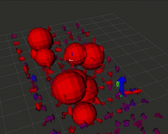
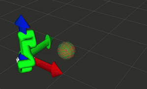

This project offers a potential field based motion planning library for robotic manipulators, written in C++ and compatible with ROS2. Utilizing attractive and repulsive force generation in SE(3), whole-body obstacle avoidance using FCL collision geometry, users are able to submit their robot's URDF and plan smooth, collision-free trajectories. The library offers two main methods for motion planning:

1. **SE(3) Task-Space Planner**: Integrates the planning frame as a 6D pose through the potential field, using the robot's inverse kinematics function to generate joint position and velocity trajectories.

  
  

2. **Whole-Body Velocity Planner**: Computes repulsive forces throughout the robot's links and combines them with attractive forces at the end-effector to produce a joint velocity trajectory that avoid obstacles while moving toward the goal.

  

_TODO: Another real robot demo video with WBV planning_

### Repository Structure:

_TODO: Insert Block Diagram Here (Work in Progress)_

#### Core C++ Library (`pfield_library`)
The `PotentialField` class orchestrates the internal components:
  *   **Obstacle Primitives:** Manages different obstacle shapes and their properties.
  *   **PFKinematics:** Handles URDF parsing, forward kinematics, and Jacobian calculations to understand the robot's geometry and state.
  *   **IK & Robot Plugins:** Provides the interface for inverse kinematics solvers, allowing different robots to be integrated.
  *   **Algorithms:** Contains the mathematical implementations for attractive/repulsive forces, RK4 integration, and velocity/acceleration limiting.

#### ROS2 Application Layer (`potential_fields` & `potential_fields_interfaces`)
The `pfield_manager` node is the central hub that bridges ROS to the underlying C++ logic. Internally, it maintains an instance of the `PotentialField` class and exposes its functionality through a handful of services and topics.

- **`PlanPath` Service:** Clients can request a end-effector trajectory (position and velocity), and/or a joint trajectory by providing start and goal poses, initial joint states, and planning parameters (tolerance, planning method, and max planning time)
- **`ComputeAutonomyVector` Service:** Clients can utilize this service to get an instantaneous end-effector velocity command based on the current robot state (end-effector pose or joint angles) and goal pose. This is useful when fusing with real-time teleoperation or higher-level planners.
- **Topics:** There are 3 topics a user can publish to in order to update the internal state of the potential field instance:
  - `pfield/planning_goal_pose`: Accepts a `geometry_msgs/Pose` message to update the internal potential field instance's goal pose.
  - `pfield/query_pose`: Accepts a `geometry_msgs/Pose` message to update a live query pose to help visualize the potential field's forces in RViz.
  - `pfield/obstacles`: The node listens to this topic to update the set of environment obstacles using `potential_fields_interfaces/ObstacleArray` messages.

## References

[1] [Principles of Robot Motion: Theory, Algorithms, and Implementations](https://ieeexplore.ieee.org/book/6267238)
